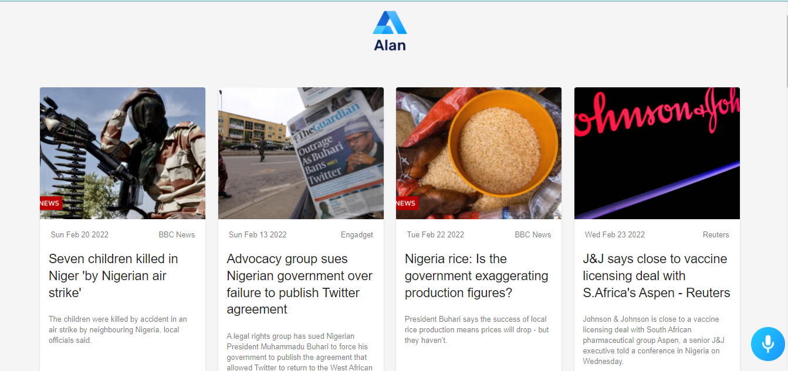

# React API News And Vioce Enabled App

#### Powered By Alan AI Voice Assistant

<!-- ### [Live Site](https://alan-news-app.netlify.app/) -->

## Introduction

This is a News Application that is voice controlled built with react.js. The app uses NewsAPI and Alan AI speech recognition software. Alan AI software allows you to control absolutely everything in the app using your voice.

Setup:

- run `npm i && npm start` to start development server
